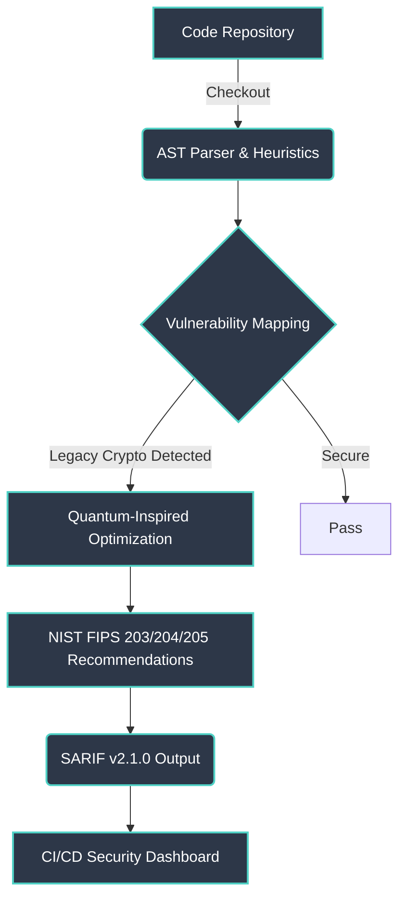

<div align="center">
  <h1>🛡️ PQ-Audit</h1>
  <p><b>Automating Post-Quantum Cryptography Migration with Zero-Trust Static Analysis</b></p>

  [](https://github.com/owner/PQ-Audit/actions)
  [](https://www.python.org/)
  [](https://opensource.org/licenses/MIT)
  [](https://github.com/owner/PQ-Audit/releases)
  [](https://github.com/owner/PQ-Audit)
</div>

---

## 🚨 The Threat Model: Harvest Now, Decrypt Later (HNDL)

The quantum threat is not a distant possibility; it is a present reality. Adversaries are currently executing **"Harvest Now, Decrypt Later" (HNDL)** attacks—systematically intercepting and storing encrypted enterprise traffic. The moment Cryptographically Relevant Quantum Computers (CRQCs) come online, this vast reservoir of stolen data will be decrypted, exposing trade secrets, personal information, and classified communications. **If your data has long-term value, it is already compromised if not protected by Post-Quantum Cryptography (PQC).**

## ✨ Key Features

*   **🔍 Zero-Trust Static Analysis:** High-precision AST parsing and regex heuristics to identify legacy cryptographic primitives across your entire codebase.
*   **📊 SARIF v2.1.0 Integration:** Seamless integration with CI/CD pipelines, outputting standardized results for modern security dashboards.
*   **🧠 Quantum-Inspired Optimization:** Advanced scheduling algorithms to prioritize and optimize your migration roadmap.
*   **🛡️ NIST FIPS 203/204/205 Mapping:** Automatically maps detected vulnerabilities to recommended NIST standardized post-quantum algorithms (ML-KEM, ML-DSA, SLH-DSA).
*   **🔄 Hybrid Composite Mode:** Identifies opportunities for hybrid cryptographic implementations to ensure compliance and backwards compatibility.

## 🏗️ Architecture



## 🚀 Installation & Quickstart

```bash
# Clone the repository
git clone https://github.com/owner/PQ-Audit.git
cd PQ-Audit

# Create a virtual environment and activate it
python -m venv venv
source venv/bin/activate  # On Windows, use `venv\Scripts\activate`

# Install dependencies
pip install -r requirements.txt

# Run the analyzer on a target directory
python main.py analyze /path/to/your/codebase --output report.sarif
```

## 🎥 Demo

<!-- PLACEHOLDER FOR TERMINAL UI GIF -->


---
<div align="center">
  <i>Built for the Quantum Era.</i>
</div>
